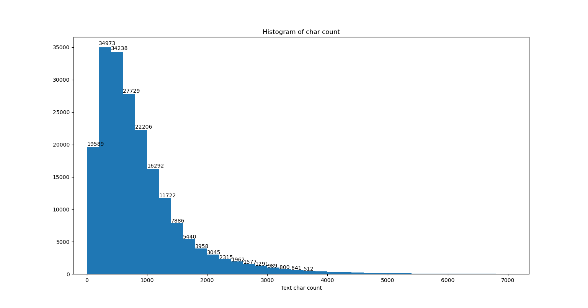
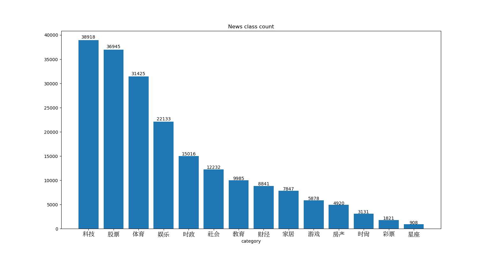
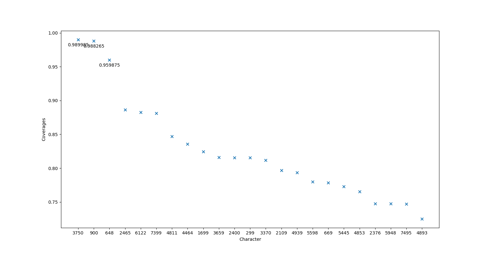
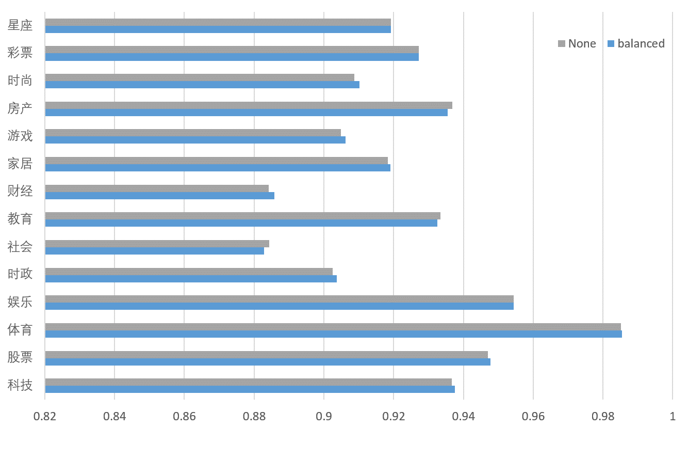

# 零基础入门NLP-新闻文本分类  

 

本次作业题目来自<https://tianchi.aliyun.com/competition/entrance/531810/information> 。该试题是一个十四分类的新闻文本分类问题。本次作业主要使用`pandas`、`numpy`、`sklearn`等库实现，利用`matplotlab`库进行绘图。主要代码分为三个文件：数据分析[`data_analysis.py`](#1data_analysispy)，数据预处理[`data_preprocessing.py`](#2data_preprocessingpy)和经典机器学习方法实现[`Classic_Machine_Learning.py`](#3classic_machine_learningpy)，在使用时只需运行对应的文件，按照提示操作即可。

本项目使用的数据集`train_set.csv`已经另行打包，也可以在项目地址登陆报名后直接下载。另有八个已经经过预处理的数据文件，后缀为`.npz`，也已打包发送。这些数据文件是供机器学习算法训练和预测时使用的，在调用`Classic_Machine_Learning.py`之前文件夹中必须有这些数据文件。可以由`data_preprocessing.py`处理`train_set.npz`获得这些数据文件，但是可能需要消耗较长的时间和内存资源，请根据情况自行选择下载或者是在本地生成这些文件。

**请把下载的文件解压到同一文件夹内**，否则程序可能无法正常运行。

下面将从[设计过程](#设计过程)和[代码文件](#代码文件)两个方面来进行说明。

## 设计过程

### 1.数据分析

赛题提供了一个包含20W条数据的训练集，其中有14个不同种类的新闻。我们将其以3：1的比例重新随机划分为训练集和测试集。按照赛题的要求选用了macro-F1 score作为结果的评价标准。下面是随机抽取的一条数据。

>
>|label|text|
>|:--:|:--:|
>|2|2967 6758 339 2021 1854 3731 4109 3792 4149 1519 2058 3912 2465 2410 1219 6654 7539 264 2456 4811 1292 2109 6905 5520 7058 6045 3634 6591 3530 6508 2465 7044 1519 3659 2073 3750 3731 4109 3792 6831 2614 3370 4269 3370 486 5770 4109 4125 3750 5445 2466 6831 6758 3743 3630 1726 2313 5906 826 4516 657 900 1871...|

其中，标签与新闻类别的对应关系如下：

>|label|class|label|class|label|class|label|class|
>|:--:|:--:|:--:|:--:|:--:|:--:|:--:|:--:|
>|0|科技|4|时政|8|家居|12|彩票|
>|1|股票|5|社会|9|游戏|13|星座|
>|2|体育|6|教育|10|房产| | |
>|3|娱乐|7|财经|11|时尚| | |

主办方对新闻文本进行了字符级别的匿名处理，以防止出现选手人工标注测试集的情况。因此我们无法使用传统的分词库如`jieba`等对其进行分词处理。

接下来对数据进行一些统计分析。

>- [句子长度分析](#句子长度分析)
>- [新闻类别分布](#新闻类别分布)
>- [字符分布统计](#字符分布统计)

#### **句子长度分析**

下表是数据集的统计结果。
>|||
>|:--|--:|
>|count|200000.000000|
>|mean|907.207110|
>|std|996.029036|
>|min|2.000000|
>|25%|374.000000|
>|50%|676.000000|
>|75%|1131.000000|
>|max|57921.000000|

每个文本的平均长度为907个字符，中位长度为676个字符，大部分文本长度都分布在0~2000个字符之间。最短的文本长度为2个字符，这不符合常识，说明数据存在一定的噪声。可以运行`data_analysis.py`查看这一分布柱形图。



#### **新闻类别分布**



可以运行`data_analysis.py`查看该分布柱形图。从统计数据可以看出这是一个类别不均衡的分类问题。大多数新闻文本分布在科技类、股票类和体育类等，而彩票和星座类的新闻非常少。在进行机器学习模型的训练时要特别注意这个问题。在[下面](#1)我们对其进行了试验。

#### **字符分布统计**



可以运行`data_analysis.py`查看该分布散点图。可以得知字符3750，900，648的覆盖率（即在文本中出现的概率，覆盖率为99%即99%的文本都有这一字符）非常高，很有可能是标点符号，没有实际意义，对文本分类可能没有帮助，可以在后续数据处理的过程中去除掉。但实际操作中没有进行这一处理，因为经过试验发现了去除这些字符后对模型分数几乎没有影响，有一些情况下甚至使分数降低了。

### 2.数据预处理

选用了词袋、TF-IDF、词袋+归一化、TF-IDF+归一化四种常见的文本处理模型进行了预处理，产生了八个数据文件，详见[`data_preprocessing.py`](#2data_preprocessingpy)

### 3.经典机器学习算法

`sklearn`库非常易于使用，只需要进行简单的调用就可以轻松实现许多机器学习领域的经典算法。因此我们尝试了11种组合的机器学习分类方式，得到的结果如下：

>|||
>|:--:|:--|
>|词袋 + 岭回归|0.8054751787253308|
>|TF-IDF + 岭回归|0.8650016524103623|
>|词袋 + 补充朴素贝叶斯(未归一化）|0.5587217916122431|
>|词袋 + 补充朴素贝叶斯(归一化）|0.6236455395292098|
>|TF-IDF + 补充朴素贝叶斯(未归一化）|0.5714294353961519|
>|TF-IDF + 补充朴素贝叶斯(归一化）|0.5576430154584509|
>|TF-IDF + 逻辑回归（未归一化）|0.8830774518048431|
>|TF-IDF + 逻辑回归（归一化）|0.8853306589459896|
>|TF-IDF + 多项式朴素贝叶斯|0.8317018955799343|
>|TF-IDF + 随机梯度下降-线性支持向量机|0.8952994340447356|
>|TF-IDF + 随机梯度下降-逻辑回归|0.9149480617277009|
>|TF-IDF + 随机梯度下降-感知机|0.8770395997616965|
>|TF-IDF + 支持向量机|0.9247983549933816|

表格中的数字是这一方法的macro-F1 score。分析结果可以看出，使用TF-IDF模型能得到比词袋模型更好的效果。这说明TF-IDF模型对数据特征的提取是更好的，不过这也付出了性能的代价——在实际运行中TF-IDF模型消耗了比词袋模型多将近一倍的内存，产生的数据文件体积也远大于词袋模型的文件体积。

在是否使用归一化的问题上，我们未能找到明确的答案。根据我们找到的资料，进行归一化处理通常能显著提高线性模型和支持向量机之类对数据分布敏感的算法的性能，并且能显著加快梯度下降法等优化问题算法的收敛，而对贝叶斯算法之类的概率模型没有什么实质性的影响。但是结果显示，使用词袋模型时进行归一化能显著提高补充朴素贝叶斯分类器的F1 score，然而使用TF-IDF模型时如果进行了归一化处理F1 score反而会略微下降。这令我们感到困惑。值得一提的是，使用补充朴素贝叶斯分类器的运行速度非常快，几乎在一瞬间就完成了运算，所以其性能明显差于其他分类器似乎也可以被理解……

我们所取得的最令人满意的结果是TF-IDF + 随机梯度下降-逻辑回归，所使用的分类器是：

```python
clf = SGDClassifier(loss='log', n_jobs=-1, verbose=1,  class_weight='balanced', tol=1e-20, alpha=0.0037862,  random_state=0x0D000721)
```

在i7-9750H上使用全部核心，训练模型只需要40s左右，分类效果也令人满意。相比之下使用TF-IDF + 支持向量机的分类结果虽然取得了最高的F1 score，但是其运行需要50000~60000s，稍显时间过长。其使用的分类器如下：

```python
clf = SVC(C=6, kernel='rbf', tol=1e-8, class_weight='balanced', verbose=1, random_state=0x0D000721)
```

<span id='1'></span>[前面提到](#新闻类别分布)该分类问题是一个不均衡分类问题，很有可能会对模型的精度造成较大的影响。我们对此感到好奇，并于是尝试对其进行探究。前述支持向量机的分类器参数中有一项`class_weight='balanced'`，就是用于解决类别不均衡问题的。当指定其参数为`'balanced'`后，分类器会自动为每个类别加权以避免偏向大类。我们尝试了将其设置为`None`，并且对比了两者的各类别F1 score，结果如下：



可以看出两者在小类别如星座、彩票、时尚上的F1 score都令人比较满意，说明是否启用该参数对分类结果的影响都不大。两者最终的结果没有什么较大的差别，这也令我们感到困惑。

以上。

## 代码文件

### 1.data_analysis.py

主要包含五个功能函数，分别为：

- `data_sample()`：输出数据样例
- `length_analysis()`：输出训练集文本长度的统计量，绘制训练集中每个新闻文本长度的分布直方图
- `news_class_count()`：绘制训练集中文本类别分布的条形图
- `char_freq()`：绘制字符频率散点图
- `char_coverages()`：绘制字符覆盖率散点图

指定了字体使得`matplotlab`绘图时能正确显示汉字。选用这个字体只是出于个人喜好。`char_freq()`和`char_coverages()`消耗大量系统资源，如需运行请注意。

>没有什么高级的用法，全都是一眼就可以看穿的代码，直接运行文件就好啦。(skr~)

### 2.data_preprocessing.py

使用四种不同的方式处理数据集，并将其保存为`.npz`格式文件以供机器学习时直接调用。由于处理后的数据为稀疏矩阵，所以定义了函数`save_sparse_csr()`来进行储存。有四个可运行函数：

- `tfidf_standardscales()`:TF-IDF 模型，StandardScaler归一化处理。产生文件名为`x_train_tfidf_scaled.npz`和`x_test_tfidf_scaled.npz`。
- `tfidf_vec()`:TF-IDF模型处理。产生文件名为`x_train_tfidf.npz`和`x_test_tfidf.npz`。
- `countvec_scaler()`:词袋模型，StandardScaler归一化处理。产生文件名为`x_train_countvec_scaled.npz`和`x_test_countvec_scaled.npz`。
- `countvec_()`:词袋模型处理。产生文件名为`x_train_countvec.npz`和`x_test_countvec.npz`

直接运行即可。

### 3.Classic_Machine_Learning.py

加载预处理的`.npz`文件，选择分类器`clf`，然后`clf.fit()``clf.predict()`。有十一个可运行函数，这里不再一一举例，直接运行文件按照指示输入即可。

>没有什么高级的用法，全都是一眼就可以看穿的代码，直接运行文件就好啦。(skr~)

以上。
